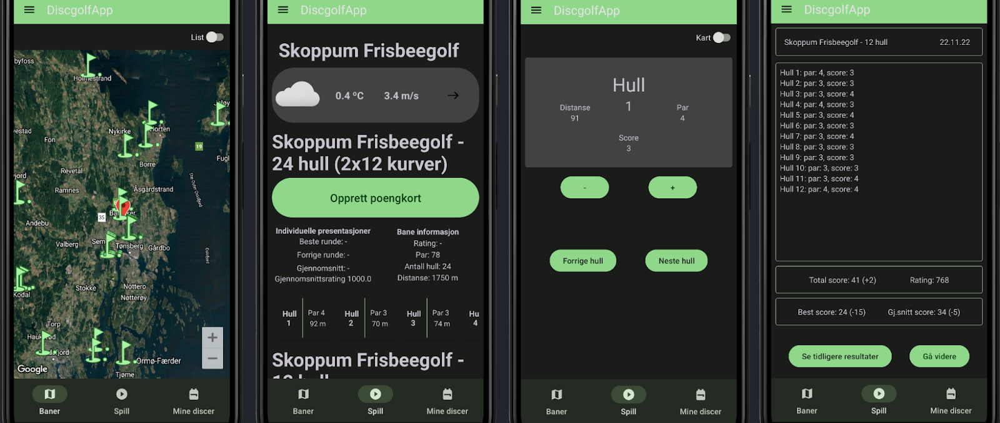
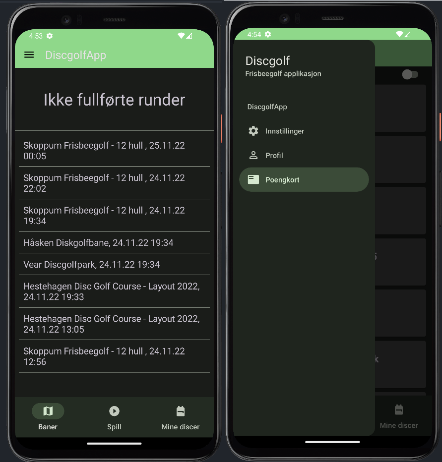
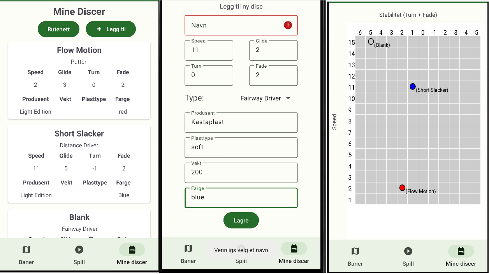
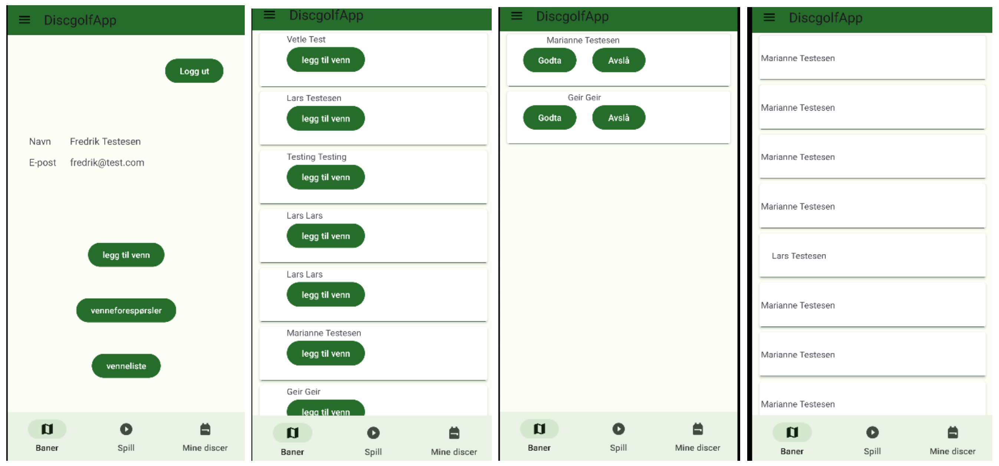
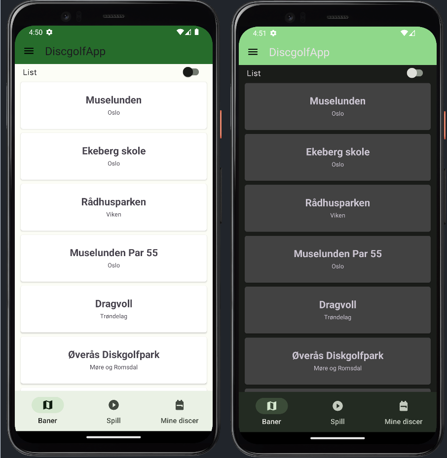

# Discgolf App

This is an Android app for disc golf developed using Kotlin developed as part of a university class on mobile app development in fall 2022.

### Core Features

#### Course Browser & Map + Scorecard

Browse every Norwegian disc-golf course that's registered on DiscgolfMetrix on an interactive Google Map. Tap a pin to see par-layout, live weather from YR API and a “Start Round” button to create a scorecard based on the par for the course. The entire catalogue is cached locally so the map still works when you lose signal.

For each hole, you can see the distance, par and your current score. Your current score is logged by you when you play by tapping the + and - buttons. After the last hole you get totals, averages and an automatically calculated Metrix rating based on their formula for ratings.

The scorecards are stored to view later. Unfinished rounds can be resumed later.

#### Disc-Bag Manager

Log every disc you own with make, plastic, weight and flight numbers. The “grid view” plots speed on the x-axis against Turn + Fade on the y-axis, giving a quick visual of gaps in your line-up.

#### Friends & Social Play

You can add friends. The idea was to make it easy to invite friends to play, but this was not implemented.

A lightweight Firebase Cloud Messaging job can nudge idle players back to the app with personalised notifications.

#### Light and Dark Mode

The app supports both light and dark mode, adapting to the system theme.

### Highlights

- **Rating engine**: each round gets an approximate Metrix rating using their formula.
- **Course map**: browse every Norwegian course on a map, with details like par, length, and location from the DiscGolfMetrix API.
- **Logging**: log your rounds and track your scores, with automatic calculations for totals and averages.
- **Disc collection**: manage your personal disc collection, including disc types, weights, and ratings.
- **Visual disc grid**: a quick, colour-coded overview inspired by MyDiscBag
